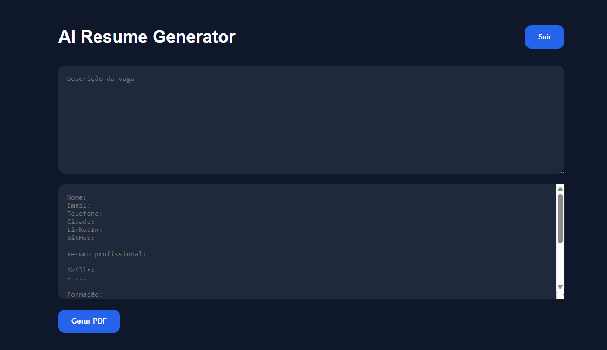

# AI Resume Generator - Frontend



Frontend application for AI Resume Generator, built with React and Vite.

This application allows users to authenticate, provide a job description and their current resume, and receive an AI-optimized version of their resume ready for download as a PDF.

## Features

* User registration and authentication
* JWT-based authorization
* Protected routes
* AI-powered resume tailoring
* PDF generation and download
* Integration with a Spring Boot backend
* Modern and responsive user interface

## How It Works

1. Create an account or log in.
2. Provide the target job description.
3. Paste your current resume information.
4. Submit the request.
5. The backend uses AI to optimize the resume according to the job requirements.
6. A customized PDF resume is generated and automatically downloaded.

## Tech Stack

### Frontend

* React
* Vite
* React Router
* Axios
* CSS

### Backend

* Java
* Spring Boot
* Spring Security
* JWT Authentication
* Google Gemini API
* PDF Generation

## Running Locally

Install dependencies:

```bash
npm install
```

Start the development server:

```bash
npm run dev
```

The application will be available at:

```text
http://localhost:5173
```

## Backend Repository

The backend source code is available at:

https://github.com/Consoli310/ai-resume-generator

## Live Demo

Frontend:

https://ai-resume-generator-nine-psi.vercel.app/

Backend API:

https://ai-resume-generator-zyaq.onrender.com

## Author

Matheus Consoli
